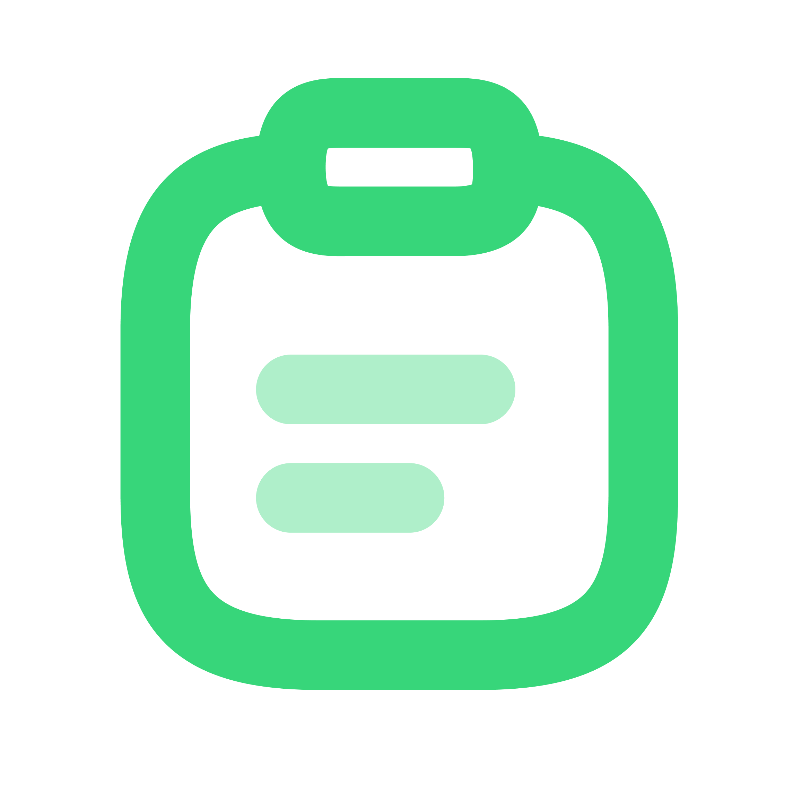

# ClipMac - Clipboard History Manager for macOS

<p align="center">
  
</p>

ClipMac is a lightweight (or is it) clipboard history manager for macOS. It keeps track of the text you copy, allowing you to easily access and reuse previous clipboard entries.

## Features

- **Clipboard History:** Stores a history of copied text items.
- **Quick Access:** Open the clipboard history popup using a global shortcut (`Control+Shift+Space`).
- **Copy to Clipboard:** Easily copy any item from the history back to your clipboard.
- **Simple Interface:** Clean and straightforward user interface.
- **Dockless Application:** Runs in the background without a dock icon.
- **Auto-launch at startup:** Automatically starts when you log in to your Mac (production build only).

## How to Use

1.  Run the application.
2.  Whenever you want to access your clipboard history, press `Control+Shift+Space`.
3.  A popup window will appear showing your recent clipboard entries.
4.  Click the "Copy" button next to an item to copy it back to your clipboard.

## Development

To build and run ClipMac locally, follow these steps:

1.  **Clone the repository (if applicable):**

    ```bash
    git clone https://github.com/najmiter/clipmac
    cd clipmac
    ```

2.  **Install dependencies:**
    Make sure you have Node.js and npm installed.

    ```bash
    npm install
    ```

3.  **Run the application in development mode:**
    This will start the Electron application.

    ```bash
    npm start
    ```

4.  **Build the application for distribution:**
    This will create a distributable `.dmg` file in the `dist` directory.
    ```bash
    npm run build
    ```

## License

This project is licensed under the MIT License - see the [LICENSE](LICENSE) file for details.

---

Developed by [@najmiter](https://github.com/najmiter)
